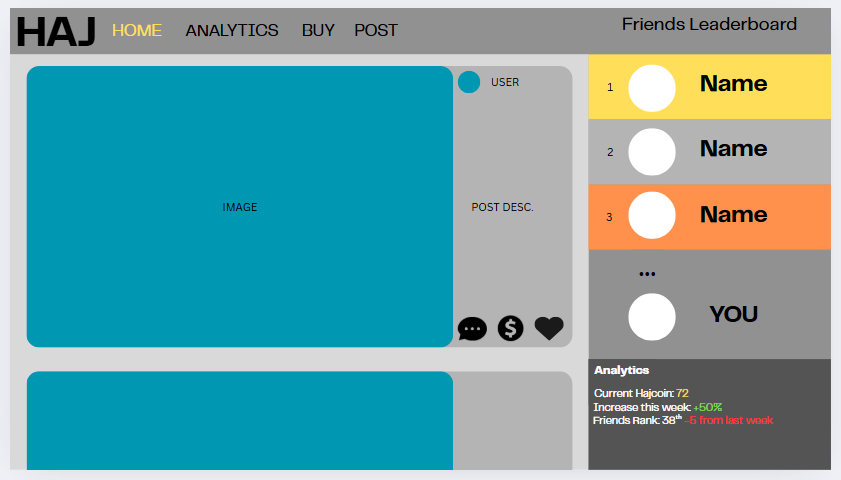

# cpt-thingy-that-i-love
MARKDOWN FILE

Here's the project:
# H1 Hajcoin 

## H2 What's it about:
Hajcoin a website designed for entrepenours aiming to make money online. It's design centered around Crypto Currencies allows for easy investments and quick money! 

## H2 Functional Requirements
1. Have users be able to sign in, and have the website track and record data so they can sign in again. 
2. Users must be able to interact with the website, be able to Like, Invest and view Comments on different posts. Data must be recorded for this. 
3. User must be able to view and interact with other people, and create friends on the site that will pop up in their feed. 
4. User must be able to buy Hajcoin, and view the amount that they and other people have by interacting with their own and other people's profiles.

## H2 Non-Functional Requirements
1. Site must run well, posts being loaded with minimal lagging between them. 
2. User must be able to switch between sites and posts seamlessly, design must be consistent. 
3. Site must be maintainable, all posts loaded under a database so it can be moderated successfully. 
4. The site must be able to store and be able to successfully load required database for it to run successfully. 

# H1 Wireframe Sketches:

These are the basic wireframe designs, showing the main functions of the site and how it will operate 

# H1 Alternate Design:
Home page for the design

The home page will have a scrolling feed, where users can scroll to see popular posts and posts they wish to invest in. On the side there is a friends leaderboard, which compells users to invest to move higher on the leaderboard. 

Analytics Page

This will track all investments and show your Haj over time. 

Buy Hajcoin Page

This is where users can buy hajcoin to invest overtime. The price will vary based on the market price for Hajcoin

Create Post UI

This is where users can create a post, that people can invest in. People will make money off the posts that they make. 